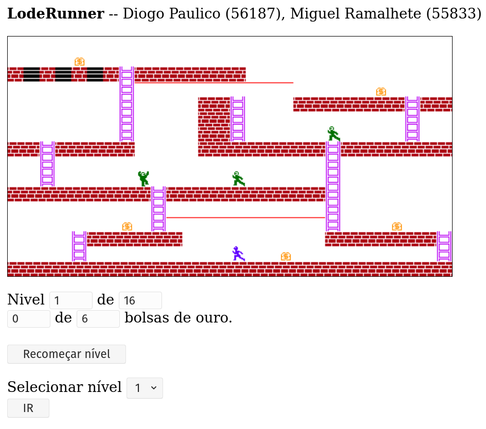

# Lode Runner

# Run the project:
* Clone the project and open index.html in a web browser
 or
* Access to the project's website [here](https://diogo-paulico.github.io/LodeRunner-LAP)

# Rules and Controls:

## Rules
All the rules from the original Lode Runner game should apply to this remake.

## Controls
|Action | Key |
|-----|-------|
|Move Left | <kbd>←</kbd> or <kbd>J</kbd> or <kbd>O</kbd>|
|Move Right | <kbd>→</kbd> or <kbd>P</kbd> or <kbd>L</kbd> |
|Shoot | <kbd>Space</kbd>|

### On Stairs Only:
|Action | Key |
|------|---------|
| Move up | <kbd>↑</kbd> or <kbd>Q</kbd> or <kbd>I</kbd>|
| Move down | <kbd>↓</kbd> or <kbd>A</kbd> or <kbd>K</kbd>|
